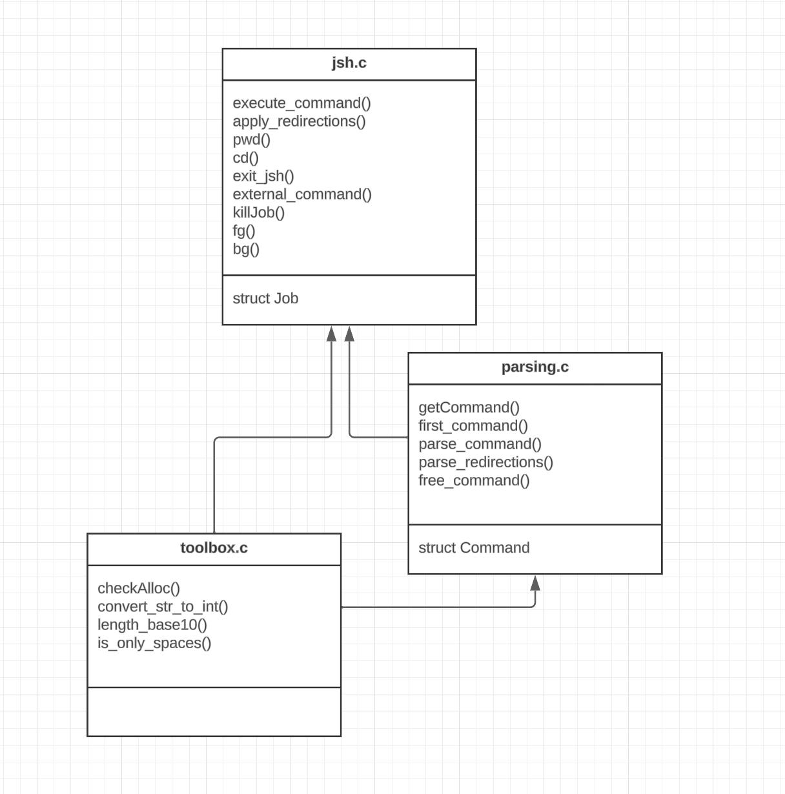

Le projet est réparti sur 4 modules :
- un module consacré au parsing (parsing_jsh.c).
- un module consacré à la gestion des jobs (jobs_jsh.c).
- le module principal consacré à la récupération et à l'exécution d'une commande (jsh.c).
- un module annexe contenant des fonctions auxiliaires utiles aux trois modules précédents (toolbox.c).

Deux structures de données sont utilisées pour le projet : une structure Job représentant un job et une structure Command représentant une commande.

# Précisions sur la structure Command:

Après la lecture et la récupération d'une ligne de commande, celle-ci est envoyée au module de parsing.
Une fois la string de commande traitée, le module de parsing renvoie une unique **structure Command** (voir définition dans parsing.h), représentant la dernière commande du pipeline (qui peut être constituée d'une seule commande) entrée par l'utilisateur.  
La structure Command fait référence à elle-même : elle contient d'autres structures Command. Ainsi, la structure Command représentant la dernière commande du pipeline entrée par l'utilisateur contient un champ "input", qui correspond à la commande qui la précède dans le pipeline. Cette dernière contient elle-même une commande dans son champ input, qui correspond à celle qui la précède, etc.  
Toutes les Command du pipeline contiennent également un champ accueillant les éventuelles substitutions qu'elles utilisent (commandes à exécuter pour constituer leurs arguments).   
Le caractère récursif de la structure de données Command induit le fait que certaines fonctions traitant les Command sont elles-mêmes récursives. C'est le cas notamment de la fonction **execute_command()**, qui a pour rôle de superviser tout le processus d'exécution d'une commande en :  
- initiant le processus d'exécution de toutes les commandes qui doivent l'être avant elle (appels récursifs).
- appelant à l'exécution de cette commande.
- libérant l'espace mémoire utilisé pour cette commande.

# Précisions sur la structure Job

La structure Job (voir définition dans jobs_jsh.c) contient cinq champs: deux stockant la string de commande à laquelle elle correspond et son pid, et trois autres stockant le numéro, l'état du job, et son emplacement à l'avant ou à l'arrière-plan. Deux variables globales en lien avec les jobs sont utilisées dans les modules jobs_jsh.c et jsh.c : l'une stockant le nombre de jobs actuel, et l'autre stockant les adresses vers les structures de tous ces jobs sous la forme d'un tableau.

# Diagramme UML du projet

Voici le diagramme UML du projet, où les fonctions les plus importantes ont été représentées :

